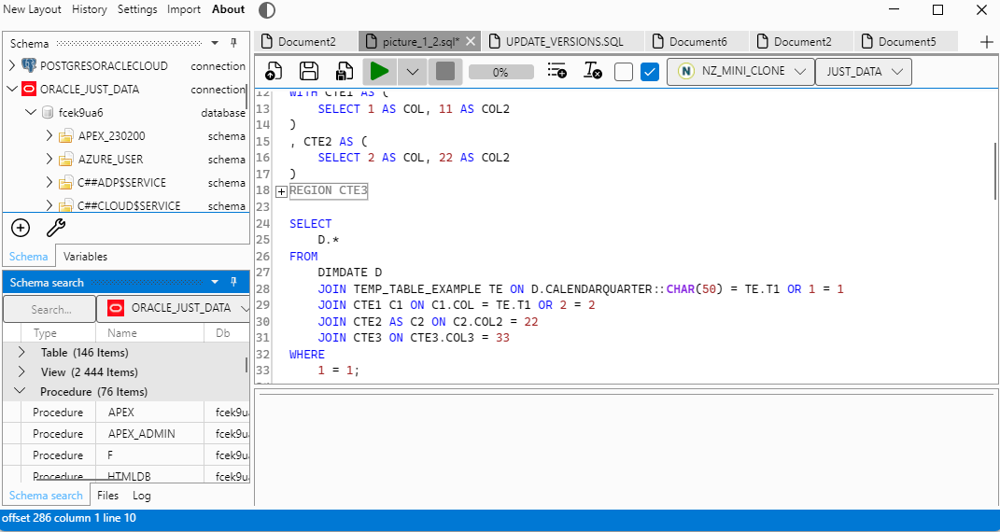

#  

This project is based on
* [Avalonia](https://avaloniaui.net/) Best C# UI framework
* [Dock](https://github.com/wieslawsoltes/Dock) A docking layout system.
* [AvaloniaEdit](https://github.com/AvaloniaUI/AvaloniaEdit) Avalonia-based text editor (port of AvalonEdit)
* [Roslynpad](https://github.com/roslynpad/roslynpad) A cross-platform C# editor based on Roslyn and AvalonEdit
* [SpreadSheetTasks](https://github.com/KrzysztofDusko/SpreadSheetTasks) fastest way to read/write from/to excel files
* [Sylvan Csv](https://github.com/MarkPflug/Sylvan/blob/main/docs/Csv/Sylvan.Data.Csv.md) fast and convenient way to work with CSV files


## How to build

[NET 9.0 SDK](https://dotnet.microsoft.com/en-us/download/dotnet/9.0) is required

go to source/JustyBase folder
```bash
cd source/JustyBase
```
and run standard dotnet publish command
```bash
dotnet publish -o publish
```
or in [AOT](https://learn.microsoft.com/en-us/dotnet/core/deploying/native-aot/?tabs=windows%2Cnet8)
```bash
dotnet publish -o publish -f:net9.0 -p:EnableAOT=true -p:EnableAOTCompress=true
```
EnableAOT, EnableAOTCompress are csproj options for AOT compilation and compression

pdb files are not needed for release version so you can remove them
```bash
del publish\*.pdb
```
Optionally you can include sql formatter before build time. It will be downloaded from github and placed in Formatter folder
This is needed only once. You can supply your own formatter but at this moment way to do this is not very user friendly.
```bash
curl https://github.com/KrzysztofDusko/PoorMansNet6/releases/download/2.0/PoorMansAot.dll -o Formatter/PoorMansAot.dll -L --create-dirs
```

Go to publish folder and run JustyBase

(or simply use JustyBase.sln in favorite IDE)

## Screenshots
 

 

## Download compiled version
* https://github.com/KrzysztofDusko/JustyBase/releases
## Help
* use github issues please
* 🚧 WIP...